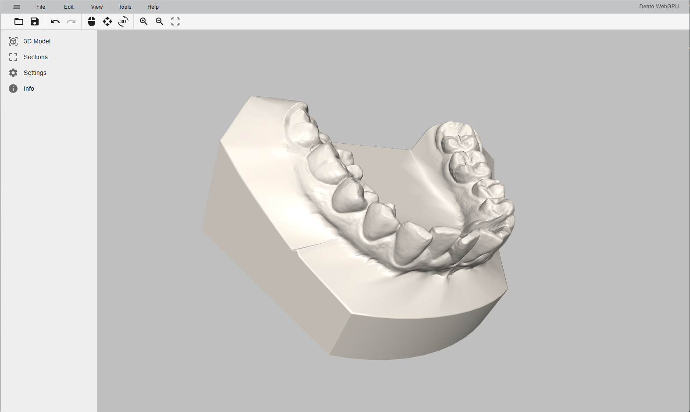

# Dento WebGPU

Desktop application for viewing and processing 3D dental scans.




## Features

- Load OBJ and STL dental scan files
- Trackball 3D rotation and zoom
- Remove scan base (density-based filtering)
- Laplacian smoothing on cut edges
- Undo / Redo support (Ctrl+Z / Ctrl+Y)

## Tech Stack

- Electron + Vite + React + TypeScript
- Babylon.js (3D rendering)
- Material UI (interface)

## Getting Started

```bash
npm install
npm run dev
```
